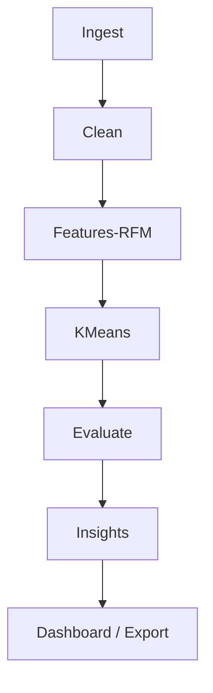

# Architecture

End-to-end pipeline:
1. Ingest CSV/XLSX
2. Clean transactional data
3. Engineer RFM features (+ totals)
4. Cluster with KMeans (configurable k)
5. Evaluate via inertia and silhouette
6. Label clusters and create business insights
7. Surface outputs via Streamlit dashboard

